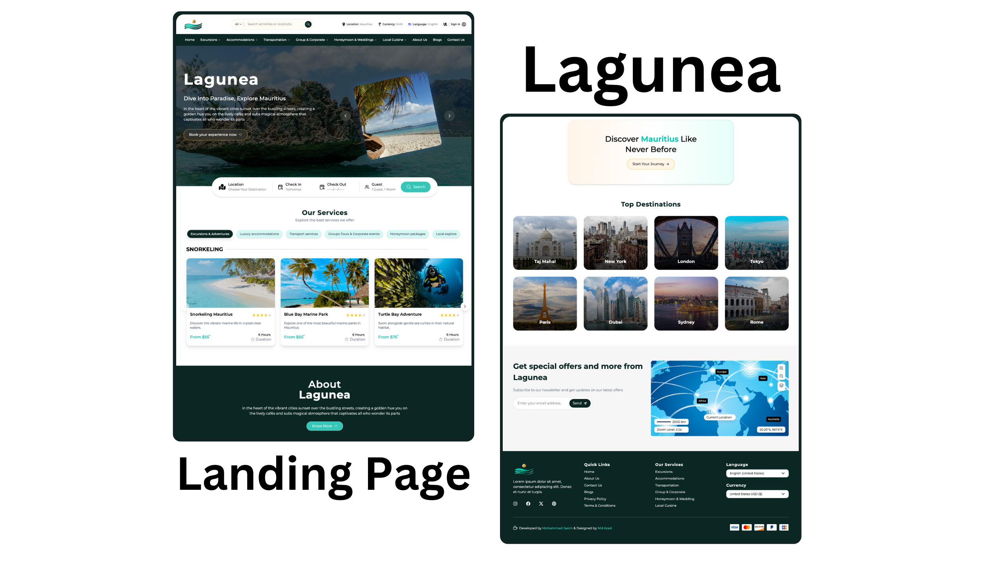

# Laguna-Landing-Page

This landing page was originally intended for one of my clients who unexpectedly disappeared. The project was supposed to be a hotel and travel booking website, but midway through, the client became unresponsive. Despite the setback, I didn’t let it discourage me. Instead, I turned it into a personal project and developed this landing page as a hobby using React.js.

<div>
<br />
    <a href="https://lagunea.buildwithjasim.tech/">
      
    </a>
</div>

## <a name="tech-stack">Tech Stack</a>

- Vite
- React.js
- Tailwind CSS

## <a name="features">Features</a>

**Stunning Sections**: Includes hero, features, pricing (monthly/yearly), FAQ, testimonials, and download software
sections.

**Smooth Animations**: Complex CSS for fluid animations and eye-catching effects.

**Seamless Navigation**: Offers a smooth user experience with intuitive navigation and scrolling.

**Optimized Performance**: Built for fast loading and an optimized experience.

**Pixel Perfect Design**: Ensures flawless responsiveness across all devices and screen sizes.

**Stunning Toast**: Provides a scrumptious Pop-up to understand the error and success rate via message.

## <a name="quick-start">Quick Start</a>

**Cloning the Repository**

```bash
git clone git@github.com:mo-jasim/Laguna-Landing-Page.git
```

```bash
npm install
```

```bash
npm run dev
```

## Contributions:

Contributions to improve the app’s functionality or user experience are always welcome. If you have ideas for new features, bug fixes, or UI improvements, feel free to fork the repository, make your changes, and submit a pull request. Feedback and suggestions can also be submitted through the business@gmail.com, where open discussions on future improvements are encouraged.